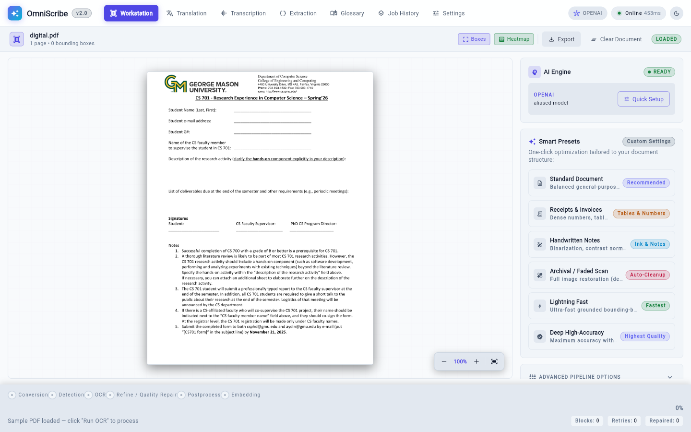
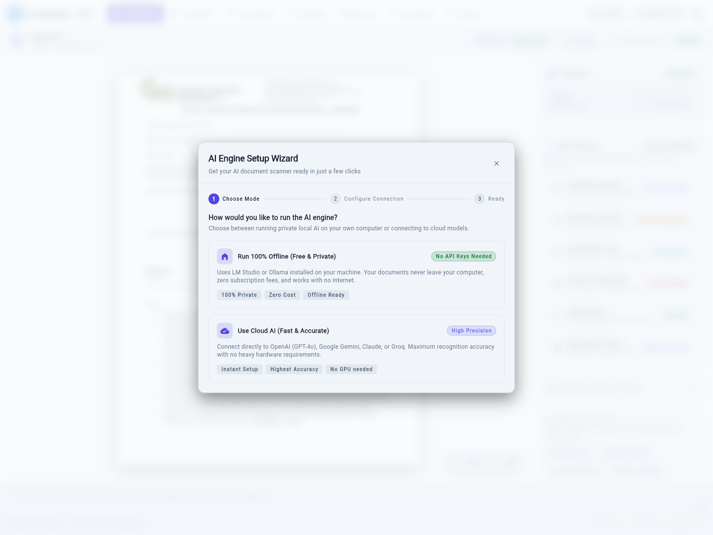
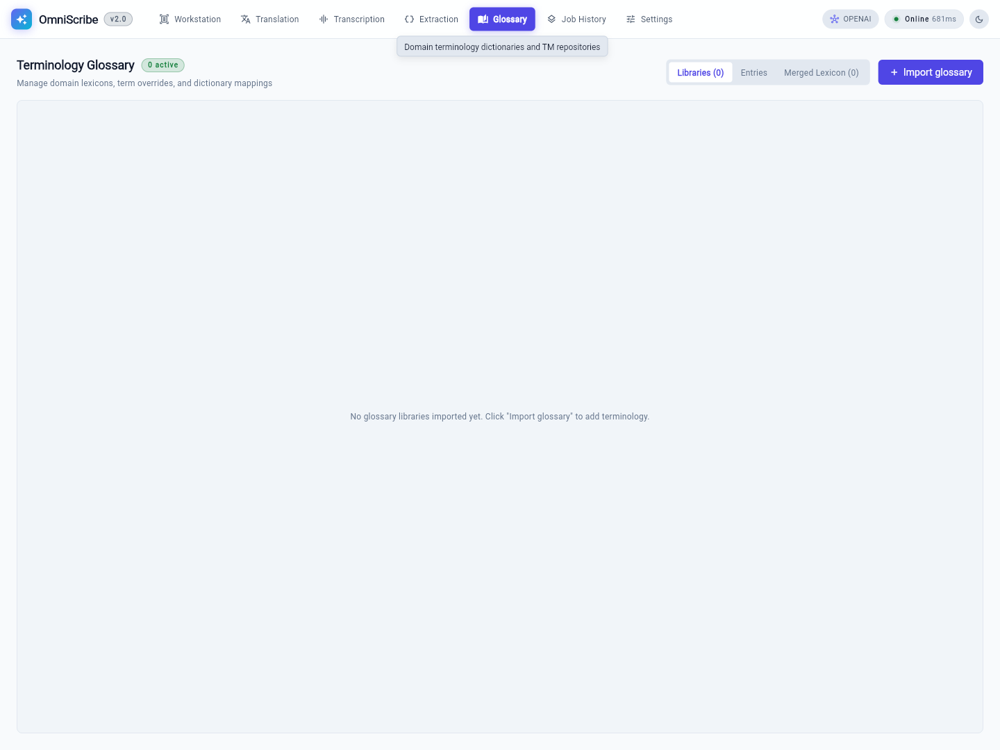
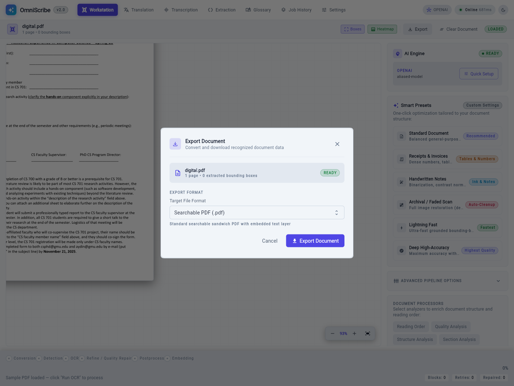

# OmniScribe

[](https://python.org)
[](https://fastapi.tiangolo.com)
[](LICENSE)
[](https://artifex.com/licensing/)

OmniScribe turns scanned PDFs and photos into searchable, selectable PDFs. It runs locally by default with no signup or service-owned API key; you can also connect an OpenAI-compatible hosted provider. The vision model is yours to choose.

## Screenshots

| **Workstation** — loaded document with pipeline controls | **AI Engine Setup Wizard** — local or cloud in a few clicks |
| :---: | :---: |
|  |  |
| **Glossary** — domain terminology lexicons | **Export** — searchable sandwich PDF |
|  |  |

More captures (provider browser, empty-state upload, provider configuration) live in [docs/screenshots/](docs/screenshots/README.md).

## Trust & Privacy

OmniScribe is local-first. By design:

- **No telemetry, analytics, or service-owned cloud.** Outbound requests occur only for endpoints and imports you configure: VLM/OCR, translation, extraction, API transcription, glossary URL/Git sources, and first-time model downloads.
- **Local by default.** OCR uses the VLM you bring. If you choose a hosted provider, task payloads can leave your machine — see [DEPLOYMENT.md](docs/DEPLOYMENT.md) §"Third-party VLM" for the privacy warning.
- **No upload, no signup, no API keys from us.** Bearer tokens for the LAN / public-internet profiles are tokens you generate yourself with `python -c 'import secrets; print(secrets.token_urlsafe(32))'`; the server ships with no default.
- **Open-source under MIT** (this project) + **AGPL-3.0** (the bundled PyMuPDF). See [SECURITY.md](docs/SECURITY.md) for the full threat model and the [Third-Party Software Notices](#third-party-software-notices) below for the PyMuPDF license details.

## Before you start

OmniScribe needs a local **OpenAI-compatible vision model server** — by default, [LM Studio](https://lmstudio.ai). Install it, open the **Search** tab, pick a vision model, then start the local server in the **Developer** tab (it binds to `http://localhost:1234/v1`).

A starting-point model table:

| Hardware tier | Suggested model | Approx. VRAM |
| --- | --- | --- |
| 8 GB GPU, no CPU fallback | Qwen2.5-VL-7B-Instruct (Q4) | ~6 GB |
| 16 GB GPU | Qwen2.5-VL-7B-Instruct (Q8) | ~9 GB |
| 32 GB GPU | Qwen2.5-VL-72B-Instruct (Q4) | ~24 GB |
| CPU only (slow) | Qwen2.5-VL-3B-Instruct | ~4 GB RAM |

If you already run an Ollama or other OpenAI-compatible server, set `LLM_API_BASE` in your environment to point at it — OmniScribe will discover the model list automatically.

## Performance expectations

Per-page cost = **local overhead + VLM time**, and the VLM term dominates. Plan for roughly `N × (VLM seconds + ~0.5 s)` for a document of N pages.

Measured local-stage timings on the bundled fixtures (reference machine: i7-12700KF, 20 threads, default DPI settings — your numbers scale with cores and DPI):

| Local stage | Per page | Notes |
| --- | --- | --- |
| Conversion (PDF → page images) | 0.03–0.06 s | CPU-bound; serial page rasterization per document for PyMuPDF thread safety |
| Sandwich embedding (searchable PDF) | 0.2–0.5 s | Re-rasterizes at embed DPI + invisible-text overlay |

PDF page conversion is CPU-bound; PyMuPDF enforces serial page rasterization per document instance for thread safety to prevent native MuPDF memory corruption and race conditions across concurrent worker threads. Layout detection (Surya, hybrid path) adds a one-time model download and a per-page cost that depends on CPU/GPU; it was not measurable in the environment this table was produced in.

The VLM call is the order-of-magnitude variable. Rough expectations tied to the model table above: a 7B-class Q4 vision model on an 8 GB GPU processes a typical page in seconds-to-tens-of-seconds on GPU and dramatically slower on CPU-only; a 72B-class model trades several times that latency for accuracy. The **Grounded** engine issues one VLM call per page (latency-optimal); the **Hybrid** engine makes multiple VLM round-trips per page (sparse/dense/refine) and is proportionally slower but measurably more accurate — see [docs/benchmarks.md](docs/benchmarks.md). On large documents, bound the cost up front with the `pages` range option instead of OCR-ing everything to find out.

A reproducible end-to-end pages/min table per hardware tier needs one live VLM benchmarking session (`uv run python scripts/confidence_eval.py --score-markdown`); the quality side of that run is tracked in [docs/benchmarks.md](docs/benchmarks.md) §Provenance.

## Features

- **Format Support**: PDFs and images, including JPEG, PNG, BMP, WebP, TIFF, and AVIF.
- **Searchable Output**: Sandwich PDFs with the original page image plus hidden searchable text.
- **Hybrid OCR**: Surya layout detection, VLM OCR, DP alignment, optional refine, and searchable PDF embedding.
- **Grounded OCR**: Bbox-native VLM path for models that return positioned text directly.
- **Local Document Intelligence**: Optional web/API processors for preprocessing (including page cleanup and handwriting preprocessing), reading order, quality analysis, structure, sections, layout enrichment, table extraction, quality routing, metadata reports, and structured exports.
- **RAG-Ready Exports**: Token-bound document export artifacts including GFM Markdown with math/table support and section-aware chunks, JSON, plain text, DOCX, Docling-compatible, and MinerU-compatible formats.
- **Lexicon & Terminology**: LanceDB-backed translation lexicon store with Lane's Arabic-English Lexicon import support (SQLite and TEI XML formats) and multi-source glossary integration (CSV, TSV, XLSX, XLIFF, TBX, TMX, SQL pair tables, Git repositories).
- **Provider Management**: Multi-format provider configuration (OpenAI, Anthropic, Ollama compatible), automatic env-var discovery, and runtime switching.
- **Voice Transcription**: Local and API-based speech-to-text audio transcription via `/api/transcribe`.
- **Flutter Client**: Windows desktop and web client built with Flutter + Riverpod (light/dark themes, Material 3, animated transitions), page selection, WebSocket progress, preview, translation, extraction, transcription, glossary browsing, and export to the OmniScribe FastAPI server.

## Benchmarks

Document-parsing quality is measured end-to-end on the exported Markdown — character/word error rates (CER/WER), BLEU, chrF, heading-structure F1, and table similarity — with `scripts/confidence_eval.py` against the bundled example fixtures. Scoring methodology, baseline tables, and the competitive positioning live in [docs/benchmarks.md](docs/benchmarks.md). Reproduce locally against a live OpenAI-compatible VLM endpoint with:

```bash
uv run python scripts/confidence_eval.py --score-markdown
```

Public-dataset runs (OmniDocBench, OCR-Quality, KIE-HVQA) are gated on the license review described in [docs/benchmarks.md](docs/benchmarks.md) §5; the in-tree mini fixtures keep the regression tests network-free.

## Installation

```bash
git clone https://github.com/Sifr-r/OmniScribe.git
cd OmniScribe
uv sync --extra web --extra preprocessing
```

If anything goes wrong, run `make doctor` (or directly: `uv run python scripts/dev.py doctor`, which is the same thing and needs no `make` — handy on Windows) — it reports Python version, `uv` on PATH, Redis reachability, and whether your VLM endpoint is actually responding on `127.0.0.1:1234`.

For asynchronous translation:

```bash
uv sync --extra web --extra preprocessing --extra async-translation
```

If you also want the translation lexicon (LanceDB-backed vector store
for domain terminology), install with the `lexicon` extra (`uv sync --extra lexicon`;
note that `memory` is supported as a one-release deprecation alias for `lexicon`). The async-translation
extra alone does **not** install ChromaDB or sentence-transformers,
so it stays light (no torch / no multi-GB ML stack):

```bash
uv sync --extra web --extra preprocessing --extra async-translation --extra lexicon
```

> **Upgrading from a pre-LanceDB version?** Migrate the legacy
> `glossary_library/library.json` + `chroma_db/lanes_lexicon`
> pair to the new LanceDB store with the `omniscribe-migrate-lexicon`
> console script (the server itself does not auto-migrate on boot):
>
> ```bash
> uv run omniscribe-migrate-lexicon --dry-run      # preview the plan
> uv run omniscribe-migrate-lexicon               # run (idempotent)
> uv run omniscribe-migrate-lexicon --verify-only # check the result
> uv run omniscribe-migrate-lexicon --strict      # exit 2 on empty store
> ```
>
> Exit codes: `0` = success (including a valid empty `lexicon.lance`
> after `--verify-only`); `1` = migration error; `2` = `--strict` only
> — empty live store when a backup manifest reports glossaries.

Real OCR requires an OpenAI-compatible VLM endpoint. The local-development default is LM Studio at `http://localhost:1234/v1`.

## Supported platforms

| Platform | Backend (Python) | Frontend (Flutter) | Binary install |
| --- | --- | --- | --- |
| Windows 10/11 | ✅ | ✅ Windows desktop | ✅ Windows server bundle (v0.3.0+) (see [docs/deployment/windows-bundle.md](docs/deployment/windows-bundle.md)) |
| macOS 13+ | ✅ | Flutter web | ❌ Not shipped |
| Ubuntu 22.04+ / Debian 12+ | ✅ | Flutter web | ❌ Not shipped |

The **source install** above is supported on all platforms, and a Windows onefile PyInstaller binary (`omniscribe-server.exe`) is supported as of v0.3.0 (with macOS and Linux using source install). The 12-step source install is documented in
[docs/TROUBLESHOOTING.md](docs/TROUBLESHOOTING.md) and is the path
[CONTRIBUTING.md](CONTRIBUTING.md) recommends for new contributors.
Docker is supported on all three (see [DEPLOYMENT.md](docs/DEPLOYMENT.md)
Profile 3).

> **Release assets are only partly automated.** The release workflow attaches
> the Python wheel and sdist. The Windows server binary and the Flutter client
> are built and attached manually — see
> [Publishing release assets](docs/deployment/windows-bundle.md#publishing-release-assets)
> for the exact steps and the release gate. A release page without an `.exe`
> on it shipped without the Windows assets; use the source install instead.

## Flutter Client

Start the backend (it serves the FastAPI surface that the Flutter client talks to):

```bash
uv run omniscribe-server --port 8000
```

Then, in another terminal, run the Flutter client:

```bash
cd client
flutter pub get
flutter run
```

The Flutter Client is the supported user workflow. Advanced document intelligence is exposed through the client's Advanced Configuration panel and FastAPI request fields; the user-facing CLI script has been deprecated.

The Advanced Configuration panel includes:

- **Preprocess Pages** with orientation detection, deskew, denoise, contrast normalization, and crop cleanup.
- **Reading Order** for deterministic top-to-bottom, left-to-right block ordering.
- **Quality Analysis** for page-level density, block counts, and advisory findings.
- **Structure Analysis** for headings, paragraphs, list items, key-values, table candidates, and empty blocks.
- **Section Analysis** for grouping content under detected headings across pages.
- **Layout Enrichment** for headers, footers, captions, page numbers, figures, title blocks, and body regions.
- **Table Extraction** for deterministic table reconstruction from OCR boxes.
- **Quality Routing** for recording local routing recommendations from quality findings.

The **OCR Quality Trust Layer** (`omniscribe.core.ocr_quality`) ships in
Phase 1 + Phase 2 + Phase 3 as an additive layer over both engines and
the `/api/process` route. Every sub-module (watermark, script detection,
hallucination guard, confidence calibration) is **off** by default and
fails open, so existing callers see no behavioural change. Each
`DocumentBlock` carries optional `trust_score` and `trust_flags` fields.
OCR blocks leave them unset until the layer is enabled; native digital readers
mark trusted source blocks directly. The runtime orchestrator is
plumbed through `OCRPipeline(trust_orchestrator=...)`; engines apply
it per page (HybridEngine decodes the page image from base64,
GroundedEngine passes `None`). The `/api/process` route accepts a
JSON-encoded `quality_options` form field and forwards
`trust_model_id=settings.model` to calibration. Responses include a
compact `X-Document-Trust` JSON header (block count, score histogram,
flagged count, per-flag counts) emitted only when at least one block
carries a `trust_score` — keeping the no-orchestrator default
byte-identical. Phase 3 ships `scripts/calibrate_model.py` (Platt
scaling via pure-numpy gradient descent with backtracking line-search)
and a pre-trained `qwen2_5_vl_72b.json` that drops ECE by 21.6% vs.
raw confidence on the synthetic fixture. Invalid `quality_options` (bad
JSON, unknown field, unparseable boolean) are rejected with an explicit
422 naming the offending field rather than being silently dropped. Today the
Flutter client has no control that sends this field, so the trust layer is
reachable over the API only; the no-orchestrator default is unchanged. The
`slow_dataset`-gated
regression tests run on OCR-Quality and KIE-HVQA fixtures via the
nightly workflow. See [ARCHITECTURE.md](ARCHITECTURE.md) for the flag
reference, fallback semantics, and dataset attribution.

OCR responses include token-bound text artifact headers. When processor metadata exists, responses also include `X-Document-Metadata-Artifact-Id` and `X-Document-Metadata-Artifact-Token`; fetch `GET /api/metadata/{artifact_id}` with the token to retrieve compact page/block metadata. Use `POST /api/export/document` to create token-bound JSON, Markdown, plain text, Docling-compatible, or MinerU-compatible export artifacts. `POST /api/export/docx` produces a `.docx` from Markdown page text. `POST /api/extract` runs structured data extraction against OCR text using a built-in template (`invoice`, `resume`, `academic`, `table`, `table_extraction`, `custom`) or a custom prompt.

### Confidence scripts

`scripts/confidence_eval.py` runs the hybrid and grounded paths against the `examples/` PDFs and reports per-document block recall, IoU, and text similarity against hand-built ground-truth fixtures. `scripts/confidence_image.py` does the same for a single image (defaults to `examples/image.avif`). Both assume LM Studio / Ollama is serving the target model at `--api-base`.

## Async Translation

`POST /api/translate/async` dispatches tree-aware translation through the
configured JobQueue. The shipped Compose profile uses the in-process worker;
Redis mode can use standalone `omniscribe-worker` processes. Poll
`GET /api/translate/status/{job_id}` for the client status vocabulary.
Translated output is stored as a token-bound text artifact and fetched
via `GET /api/text/{artifact_id}` — no Celery worker is needed; the
compose stack runs `api` + `redis` only.

## Validation

```bash
uv run pytest
uv run pytest -m "not slow"
uv run pytest -m slow
uv run ruff check src tests
uv run ruff format src tests --check
uv run mypy src
cd client && flutter pub get && flutter analyze && flutter test && flutter build web --release
```

Slow tests load Surya and may download its model on the first run.

## Architecture

See [ARCHITECTURE.md](ARCHITECTURE.md) for pipeline details, extension points, and staged document-intelligence notes.

## Third-Party Software Notices

OmniScribe is released under the [MIT License](LICENSE). It depends on
PyMuPDF (Artifex Software) for PDF rendering and sandwich-PDF embedding.
PyMuPDF is dual-licensed under AGPL-3.0 and a commercial license; the
upstream library itself is AGPL-3.0. The bundled PyMuPDF is for use by
end users — internal OCR, personal use, and AGPL-compatible use cases.

**If you distribute OmniScribe (or a derived product) outside your
organization in a way that is *not* AGPL-3.0-compatible, you are
responsible for obtaining a commercial PyMuPDF license from Artifex
Software.** A one-time warning is also logged the first time this
package processes a PDF, as an in-product reminder. See
<https://artifex.com/licensing/> for license details.

If you want a license-clean default for closed-source distribution,
swap to the Apache-2.0 `pypdfium2` backend and stop importing
`pymupdf`; the OCR pipeline's render-and-embed call sites use a small
PDF-handling surface that pypdfium2 covers with feature parity.

## For developers

- The supported user workflow is the **Flutter client** + **FastAPI server**. The previous in-browser workstation is deprecated.
- The `OCRPipeline` class is importable from `omniscribe.pipeline` for in-process programmatic use. No generic interactive `omniscribe` CLI script is shipped — programmatic use is the supported path.
- Four CLI console scripts are registered in `pyproject.toml` for runtime execution and data maintenance:
  - `omniscribe-server`: Starts the OmniScribe FastAPI application server (HTTP/WebSocket API surface).
  - `omniscribe-worker`: Runs the standalone async background task worker process for Redis job queues.
  - `omniscribe-migrate-lexicon`: Migrates legacy glossary libraries and ChromaDB stores to the LanceDB lexicon backend.
  - `omniscribe-import-lanes-lexicon`: Ingests Lane's Arabic-English Lexicon from SQLite and TEI XML formats into LanceDB.
- See [ARCHITECTURE.md](ARCHITECTURE.md) for the component map and full API surface.

## See Also

- [CHANGELOG.md](docs/CHANGELOG.md) — version history and breaking changes
- [ARCHITECTURE.md](ARCHITECTURE.md) — pipeline, component map, and full API surface
- [DEPLOYMENT.md](docs/DEPLOYMENT.md) — local / LAN / public-internet deployment profiles
- [SECURITY.md](docs/SECURITY.md) — threat model, hardening checklist, vulnerability disclosure
- [AGENTS.md](docs/AGENTS.md) — contributor guide and full env-var reference
- [TROUBLESHOOTING.md](docs/TROUBLESHOOTING.md) — first-run error guide
- [Windows bundle guide](docs/deployment/windows-bundle.md) — build, smoke-test, and distribution notes for the shipped server binary

_Last updated: 2026-09-27_
